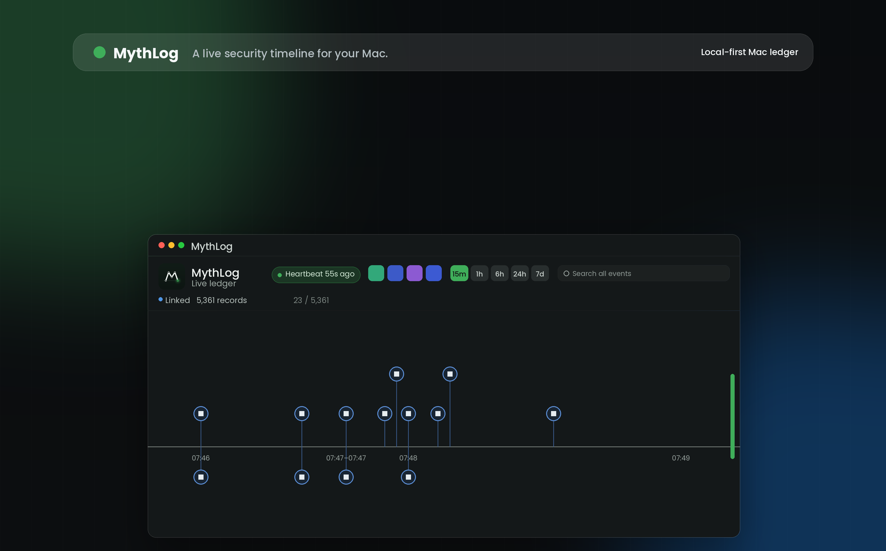

  

<h1 align="center">MythLog</h1>

<em>Know what happened while you were away</em>

  
  
  

MythLog is a consent-first macOS security event recorder and timeline viewer, written in pure Swift. It records meaningful local security and system events — screen lock/unlock, sleep/wake, app activity, file changes, notification results, and custom events — into a tamper-evident HMAC hash-chain ledger, then shows them in a live SwiftUI timeline so you can answer one question later: *what happened while I was away?* It behaves like a transparent macOS citizen: no stealth, no privacy-prompt bypass.

## Install

1. **Open** `MythLog-<version>.dmg` and drag `MythLog.app` to your Applications folder.
2. **Launch** MythLog, choose **Recorder → Install Recorder at Login…**, and approve macOS Background Items if prompted.

The DMG is intentionally drag-only — setup lives inside the app, not in the DMG.

Builds are produced locally with `./scripts/package-dmg.sh`; see [Releasing](docs/RELEASING.md).

## What It Does Not Record

MythLog should stay inside these boundaries:

- no keylogging
- no screenshots
- no microphone recording by the agent
- no chat, browser, or private-content scraping
- no hidden persistence
- no privilege escalation without explicit user consent
- no bypassing macOS privacy prompts

Any contribution that changes those boundaries should be treated as a security/design discussion first, not a casual feature.

## Features

- **Tamper-evident ledger** — every event is HMAC-signed into an append-only hash chain, with off-device iCloud hash anchoring to detect truncation or rewrites.
- **Live timeline** — a horizontal SwiftUI timeline with filters, search, zoom, an event inspector, and at-a-glance recorder health and ledger integrity.
- **Native event sources** — screen lock/unlock, sleep/wake, app launch/activation/termination, file/canary changes, agent heartbeats, and notification results.
- **Custom events** — scripts and tools emit structured events via `mythlogctl emit-log` and appear in the timeline.
- **Watched Folders** — grant folders through a standard open panel; changes flow into the ledger (active while the app runs on the sandboxed build).
- **App Store ready** — a fully sandboxed build with an App Group container, SMAppService login item, and attributed failures for anything the sandbox forbids.
- **Built to be used by everyone** — the timeline reads as full sentences under VoiceOver in chronological order, text and controls scale with Dynamic Type, severity never depends on color alone, every control works from the keyboard, and Reduce Motion is respected. See [Accessibility](docs/ACCESSIBILITY.md) for what is verified and what is still missing.

## Documentation

Full documentation lives in [`docs/`](docs/):

| Page | What it covers |
| --- | --- |
| [Architecture](docs/ARCHITECTURE.md) | Package layout, ledger, spool transport, and boundaries |
| [Security Model](docs/SECURITY_MODEL.md) | Threat model, HMAC hash chain, and hash anchoring |
| [Sandbox Behavior](docs/SANDBOX_BEHAVIOR.md) | Per-feature sandboxed vs unsandboxed behavior |
| [Custom Events](docs/CUSTOM_EVENTS.md) | Emitting events from scripts and tools |
| [Accessibility](docs/ACCESSIBILITY.md) | VoiceOver, Dynamic Type, keyboard, color, and known gaps |
| [Installer](docs/INSTALLER.md) | Recorder install/login-item flow |
| [Uninstall](docs/UNINSTALL.md) | Removing MythLog and its local data |
| [Releasing](docs/RELEASING.md) | Building, signing, notarizing, and packaging a release |

## License

MythLog is proprietary software. See the [LICENSE](LICENSE) file for terms; use of the compiled app is governed by the Mac App Store Terms and Conditions where applicable.
